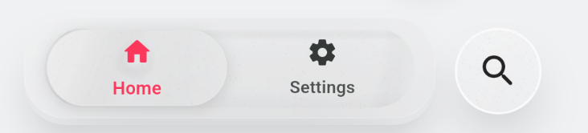
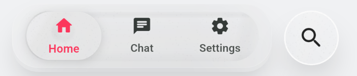
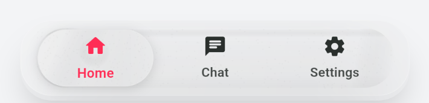

# glass_bottom_navigation

A customizable frosted-glass bottom navigation bar for Flutter.

## Features

- Simple API: pass `items`, `currentIndex`, and `onTap`
- Optional built-in search action via `onSearchTap`
- Optional `width` and `height` overrides
- Auto layout behavior:
  - Without search: centered bar
  - With search: trailing glass search button layout
- Auto sizing defaults:
  - Width: responsive to device size
  - Height: responsive to device size
- Supports only 2 to 4 navigation items (enforced by assertions)
- Optional `GlassBottomNavStyle` to customize appearance

## Getting started

Add the package:

```yaml
dependencies:
  glass_bottom_navigation: ^0.1.0
```

Then import:

```dart
import 'package:glass_bottom_navigation/glass_bottom_navigation.dart';
```

## Usage

```dart
GlassBottomBar(
  items: const [
    GlassBarItem(icon: Icons.home_rounded, label: 'Home'),
    GlassBarItem(icon: Icons.chat_rounded, label: 'Chat'),
    GlassBarItem(icon: Icons.person_rounded, label: 'Profile'),
  ],
  currentIndex: currentIndex,
  onTap: (index) => setState(() => currentIndex = index),
  // Optional: if omitted, both are auto-sized responsively.
  width: 300,
  height: 60,
  onSearchTap: () {
    // Optional: if null, no search button is shown.
  },
)
```

### Customize style

```dart
GlassBottomBar(
  items: items,
  currentIndex: currentIndex,
  onTap: onTap,
  style: const GlassBottomNavStyle(
    accent: Color(0xFF004D40),
    height: 60,
    widthFactor: 0.90,
  ),
)
```

## Example app

A full runnable demo exists in `/example` and includes:

- 2-tab, 3-tab, and 4-tab setups
- Search on/off toggle
- Visual behavior for centered vs trailing-search layouts

## Screenshots / GIFs

### 2 Tabs



### 3 Tabs



### 3 Tabs (No Search)


